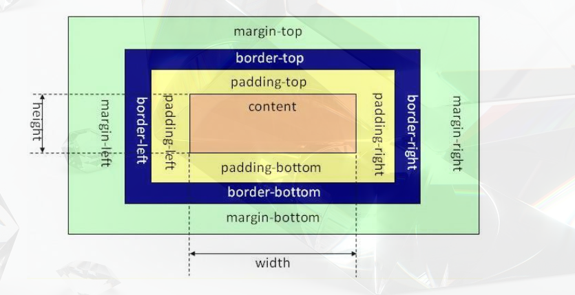

# css盒子模型

盒子模型一共分为两种，
#### 标准盒模型，
`width`/`height`指的是`content`区域的宽度和高度。

#### 怪异盒模型
`width`/`height`指的是`content`+`padding`+`border`。
  

### box-sizing 
>  `box-sizing`用于修改以上的两种盒子模型，一般用来模拟不正确支持CSS盒子模型规范的浏览器行为。  

1️⃣ `content-box` 是默认值，对应`标准盒模型`，也就是元素的宽度不会包括`内边距`和`边框`。

2️⃣ `border-box`，内容区的实际宽度`content`会是`width`减去(`border`+`padding`)，是的我们更容易去设定一个元素的宽高。当`width`属性固定的时候，增加`padding`和`border`的值，浏览器会自动压缩`content`的宽度。

### 总结
1️⃣ `content-box` 在元素外部增加边距，会影响自身盒子大小，会破坏原有布局。

2️⃣ `border-box` 在元素内部增加边距，不会影响自身盒子大小，不会破坏原有布局。

### margin纵向合并
若纵向相邻的两个元素，垂直方向上，都设置有marin值，那么最后两个元素最后的纵向距离只会是较大的那个纵向值。   

### 使用场景
* 在`input` 和 `textarea` 等表单元素
* 比如两个内部元素各占一半，我们喜欢设置为`width:50%`，然后添加了边框修饰之后，就会出现换行的情况，我们习惯性设置为`width:49%`这样的偷鸡技巧。此时，我们使用`box-sizing:border-box;`则可以把`padding+border`都计算在50%de 宽度中了。

___
### 参考资源
[图片来源](https://www.jianshu.com/p/2f2cf326795d)

