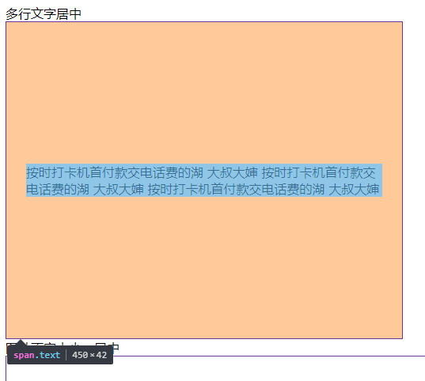
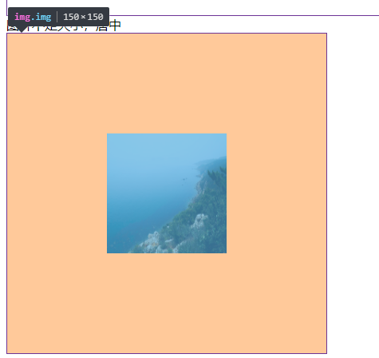
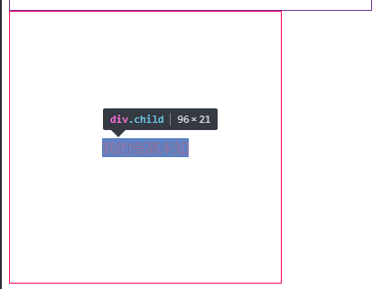

# “内容”如何垂直居中
___
### 块元素在 `高度确定` 容器元素中垂直居中

```css
 #container{
     height:400px;
 }
 /* 单行文本 */
 .singleLine{
     line-height:400px;
 }
 /* span 标签包裹的多行文字 */
 span.multiLine{
    position:absolute;
    top:0;
    left:0px;
    right:0px;
    bottom:0px;
    width:90%;
    height:fit-content;
 }
```


#### 图片也同样适用
```css
/*父元素相对定位 */
#parent {position: relative;}  
/*子元素绝对定位 */
#child {
    position: absolute;
    top: 0;
    bottom: 0;
    left: 0;
    right: 0;
    margin: auto;
 }
```



 ### 未知宽高元素，在容器中水平垂直居中
 ___
 #### 使用table布局
 * 兼容性: IE8 以下不支持
 ```css 
 .parent{
     display:table;
     height:300px;
     width:300px;
     background-color:#FD0C70;
 }
 .parent .child{
      display:table-cell;
      vertical-align:middle;
      text-align:center;
      color:#fff;
      font-size:16px;
 }
 ```
 #### 使用flex布局
 * 兼容性： `IE 11`以下版本不支持
 ```css
 .parent{
    display:flex;
    justfy-content:center;
    align-items:center;
    width:300px;
    height:300px;
    /* background:#FD0C70; */
    border:1px solid #FD0C70;
 }
 .parent .child{
     color:#fff;
  background-color:rebeccapurple;
 }
```


#### absolute(定位) + translate(平移)     
* 使用子元素定位,设定顶部和左边距离都为50%，然后使用css3的tranform:translate平移归位
* 兼容性：不支持IE9一下浏览器

```css
.parent{
    position:relative;
    height:300px;
    width:300px;
    background-color:#green;
}
.parent .child{
    position:absolute;
    top:50%;
    left:50%;
    color:#fff;
    transform:translate(-50%,-50%);
}
```