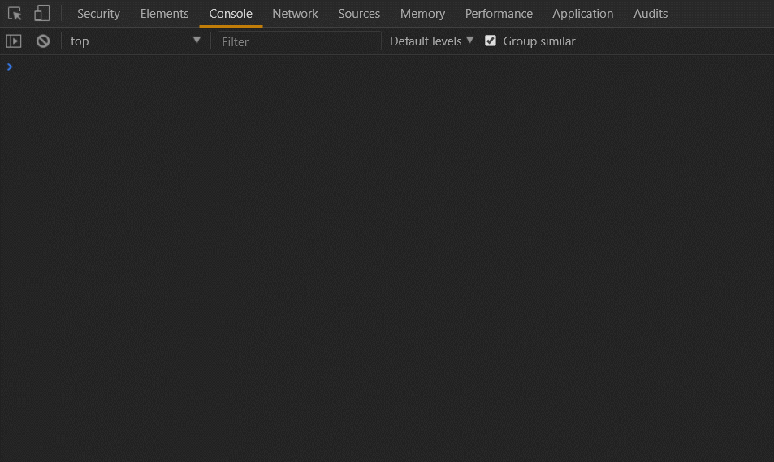
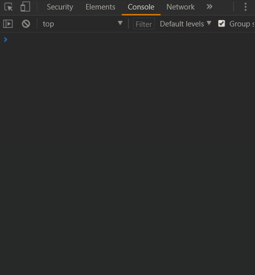

# 大有用途的 Set & Map


* `Set`可以接受一个具有`iterable`接口的数据作为创建基础
```js
 const set = new Set([1,3,4,5,6]); //数组
 const domSet = new Set(docuemnt.querySelector("div")); //DOM数组
```
也可以传入 类数组


* `Set`中的重复检测
  * 其规则类似于`===`的校验(唯一区别是，`NaN`在Set中也不可以重复)。
  * 两个对象的引用也总是不相同的，所以`Set`中允许存在值相同的对象。

* Api
    * `add(value)`：添加某个值，返回 Set 结构本身。
    * `delete(value)`：删除某个值，返回一个布尔值，表示删除是否成功。
    * `has(value)`：返回一个布尔值，表示该值是否为Set的成员。
    * `clear()`：清除所有成员，没有返回值。

* `Array.from`方法可以将`Set对象`转换成为`Array对象`
* Set的遍历
    * `keys()`：返回键名的遍历器
   * `values()`：返回键值的遍历器
    * `entries()`：返回键值对的遍历器
    * `forEach()`：使用回调函数遍历每个成员
    * ps：返回的遍历器对象，可以使用`for循环`等方法进行遍历。

## Map
Map 也就是我们常用的字典集概念
* 与 `Set`一样，拥有元素唯一性
* 初始化的时候，可以传入一个也可以接受一个双元素数组作为参数。
```js
const dobleProArr = [
    ["name":"小李"],
    ["id":"456"],
    ["height":175]
];
const map1 =  Map(dobleProArr);
map1.get("name"); //小李
map1.get("id"); //456
```

### 实际生产中的用处

