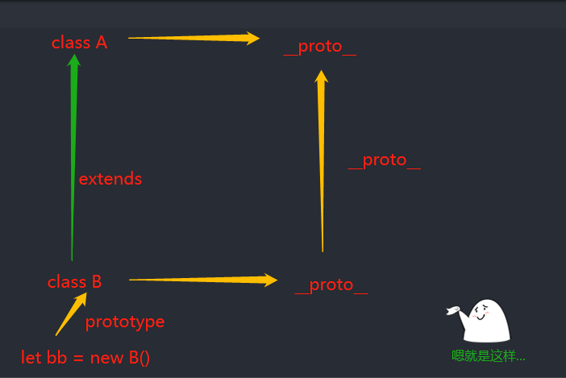

# es6_类的继承

## 子类的构造函数
* 子类必须在`constructor`中使用 `super`关键字调用父类的构造方法，因为子类没有自己的`this`对象，必须调用父类的
否则报错
```error
VM3089:2 Uncaught ReferenceError: Must call super constructor in derived class before accessing 'this' or returning from derived constructor
    at new myPoint1 
```
* 子类也可以不显式书写构造函数，作用等同于默认调用父类的构造函数进行构造
* 子类的构造函数，其作用主要是①调用父类构造函数 ②对父类工造函数进行改造、修饰
所以在使用`super`关键字对父类进行调用前，不可以使用`this`关键字调用属性，进行性修饰

### 子类的实例
* 子类的实例既是子类的`实例`，也是父类的`实例`，这里的实例是我们常提到的`instance`
```js
   class Men extents Person{};
   let Tony = new Men("tony","177");
   Tony instanceof Men;   // true 
   Tony instanceof Peoson;  // true
```
### 子类可以继承父类的静态方法
* 如另一篇[文章](https://github.com/HXWfromDJTU/blog/blob/master/es6_class.md)第五点特性提到的，父类的静态方法可以被其子类所继承
```js
class A{
    static fatherFun = function(){
         cosnole.log("this is father static function")
    }
}
class B extends A{}
B.fatherFun(); // this is fatehr static function
```
### 获取父类
```js
  class Son extends Father{}
  Object.getPrototypeOf(Son)  === Father;  // true
```
### super关键字
### 实例的__proto__属性

