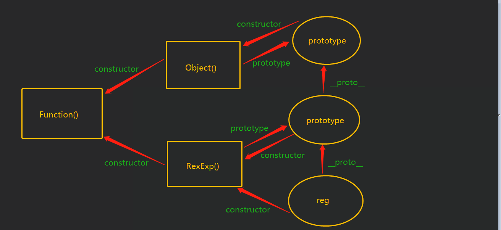

# Javascript 所有对象上的公共  属性/方法

## 公共方法

### Object.prototype.hasOwnProperty() 
>  判断一个对象上是否有这个属性
* 注意该方法不会沿原型链向上寻找,只找寻自身定于的属性

### Object.prototype.isPrototypeOf(obj)
> 判断这个对象是否是目标对象的原型
* 其实就是寻找 `obj`的`__proto__`是否指向`Object`的`prototype`

### obj.prototype.propertyIsEnumerable(prop)
> 检测对象上的这个属性是否可以枚举
* 每个对象都有一个`propertyIsEnumerable`方法。
* 此方法可以确定对象中指定的属性是否可以被for...in循环枚举，但是通过原型链继承的属性除外。
* 如果对象没有指定的属性，则此方法返回`false`。

### Object.prototype.toLocaleString() 
### Obejct.toString()
> 使用字符串表示该对象

### Object.prototype.valueOf()
> 获取对象本身的原始值

* `Array` 	返回数组对象本身。
* `Boolean` 	布尔值。
* `Date` 	存储的时间是从 1970 年 1 月 1 日午夜开始计的毫秒数 UTC。
* `Function` 	函数本身。
* `Number` 	数字值。
* `Object` 	对象本身。这是默认情况。
* `String` 	字符串值。
>  	`Math` 和 `Error` 对象没有 `valueOf` 方法。

## 公共属性     
*  object.prototype
* object.__ proto__
* obj.constructor

