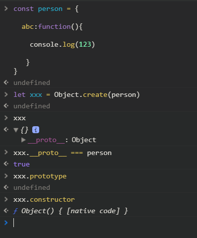
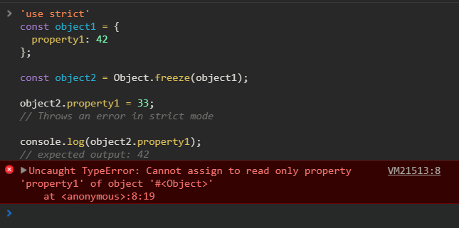
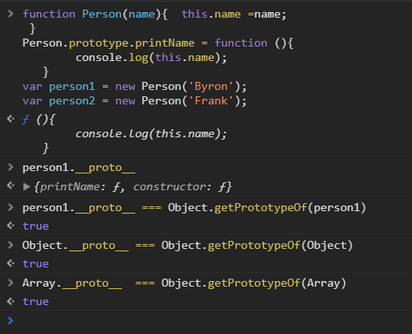
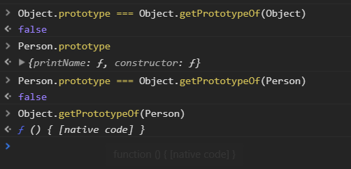
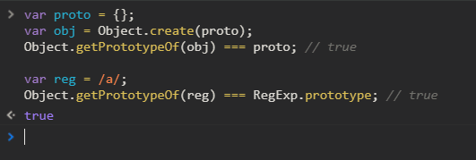
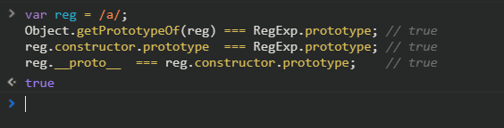
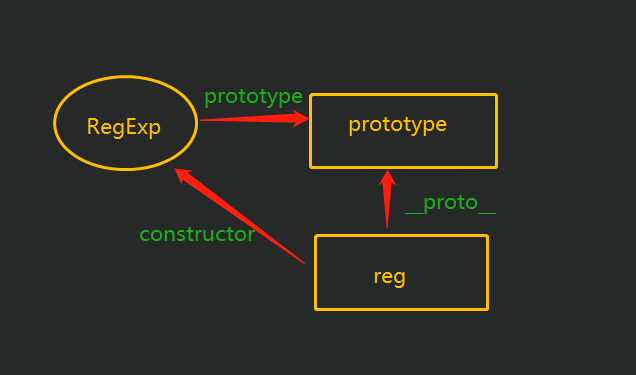
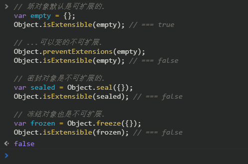
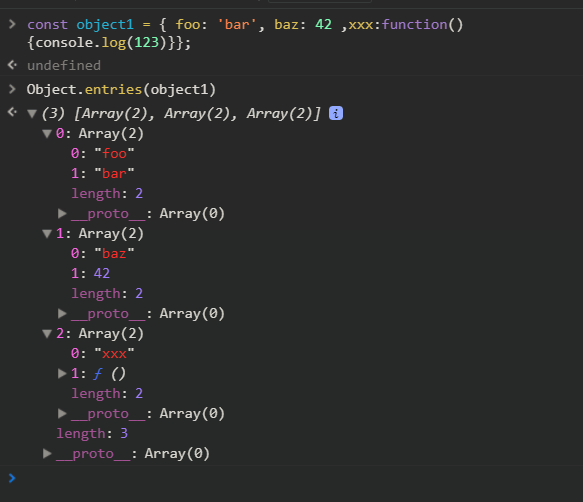

#  Object 的原生方法
> 在各种框架中，通过Object底层的方法，对所有变量的属性进行监控、修改、定义、枚举，以实现双向绑定


## ①处理对象的方法
### Object.assign()  |  拷贝
> 将一个或者多个源对象上的，所有可以被枚举的属性，通通复制到目标对象上
* 第一个参数是目标对象
* 后面可以不断传入对象，用逗号分隔
* 目标独享中的属性，后续会被传入的源对象上的相同属性所覆盖
```js
Object.assign({aa:11,bb:22},undefined)
// {aa: 11, bb: 22}
Object.assign({aa:11,bb:22},{kk:99})
// {aa: 11, bb: 22, kk: 99}
Object.assign({aa:11,bb:22},"sasas")
// {0: "s", 1: "a", 2: "s", 3: "a", 4: "s", aa: 11, bb: 22}
Object.assign({aa:11,bb:22},12)
// {aa: 11, bb: 22}
Object.assign({aa:11,bb:22},new Date())
// {aa: 11, bb: 22}
```

### Object.create() | 创建
> 创建一个新对象，使用现有的对象来提供新创建的对象的__proto__。



### Object.defineProperties(obj,props) | 设置多个

> 顾名思义，就是要给这个对象(js中的所有变量),修改其配置的属性

* 第一个参数就是要被修改的对象

* 第二个参数是一个对象，每一个key都是将要定义在目标对象上的属性，key对应的是该属性的配置项，分为多个配置项：
   * `configgurable`: 默认值为`false`
   `true`当且仅当该属性描述的类型可以被`改变`，并且该属性可以从对项中`删除`。
   * `enumerable`:
   当且仅当在美剧相应对象上的属性时，该属性显现。
   * `value`:
   该对象对应的值
   * `writable`: 默认为`false`
   当且晋档该属性相关联的值，可以使用`assignment operator`改变时为`true`。
   * `get`
   也就是该属性的`getter`函数
   * `set`
   也就是该属性的`setter`函数
   ```js
   let obj = {};
   Object.defineProperties(obj, {
    'property1': {
      value: true,
      writable: true
    },
    'property2': {
     value: 'Hello',
     writable: false
   }
  });
   ```

### Object.defineProperty(Obj,prop,descriptor) | 设置

> 在一个对象上定义一个属性，并且配置该属性的一些基本信息

 * `Obj` 
  将要修改的对象主体
    
 * `prop`
   将要添加的属性名称

 * `descriptior`
    该属性的配置项，同样有`configurable`、`enumerable`、`value`、`writable`、`get`、`set`


### Object.freeze(obj) | 冰冻

> Winter is coming 指的是不能够对这个对象进行任何的，`增加`、`修改`、`删除`，也不能够改变其`枚举性`、`可配置性`、`可读性`。返回被冰冻的对象。


### Object.seal(obj) | 封闭
> 将一个对象变为封闭对象
*  添加新的属性
* 并将现有的属性标记为不可配置
* 现有的属性值仍可改变
### Object.preventExtensions(obj) | 不可拓展
> 将一个对象变为不可以拓展对象,并返回

## ②获取各种属性的方法

### Object.getOwnPropertySymbols(obj) | 获取 symbol 属性
> 获取对象上所有的 `symbol`属性组成的数组。

注意：
* `Object.getOwnPropertyNames()`本身不包含对象的 `Symbol` 属性，只包含字符串属性。

* 因为所有的对象在初始化的时候不会包含任何的 `Symbol`，除非你在对象上赋值了 `Symbol` 否则`Object.getOwnPropertySymbols()`只会返回一个空的数组。

### Object.getPrototypeOf(obj) | 获取原型
> 给定对象的原型。如果没有继承属性，则返回 null 。
* 其实是获取了对象的`__proto__`属性

* 注意不是获取了`obj`的`prototype`

* `Object.getPropertyOf(obj)`，若`obj`是一个实例，则返回的正好是其构造器的`prototype`


* 最后我们也证实了，一个对象实例的`__proto__`，指向的就是其构造器的`prototype`




## ③判断方法

### Object.is(obj1,obj2) | 判断相等
> 用于比较任意两个变量的值，不限与任何对象，等同于 `===` 符号

### Object.isExtensible() | 判断是否可拓展
> 判断一个对象是否可以拓展，是否在这个对象上添加新的属性。


### Object.isForzen() | 判断是否冰冻
> 判断一个对象是否已经被 ”冰冻“

对应方法
##### Object.freeze()
> 将一个对象“冰冻起来”
* 不可拓展对象不等于"冰冻"对象

"冰冻“对象的几种可能
* 这个对象被删除`delete testObject`，则为“冰冻”对象
* 一个对象，既不可配置，也不能写。则为“冰冻”对象
* 使用`Object.freeze()`处理过的方法，一定为"冰冻"对象

* “冰冻”对象也一定是`密封对象`和`不可拓展对象`。

### Object.isSealed() | 判断是否封闭
> 判断一个对象是否是密封对象

对应方法 
##### Object.seal()
> 将一个对象处理为密封对象
密封对象有以下特性：
* 不可拓展
* 不可配置
* 不可删除


## 遍历方法

### Obejct.keys() | 获取所有keys
> 返回由对象所有`key`一起组成的数组

### Object.values() | 获取所有values
> 返归由对象所有的可枚举的值组成的数组

### Object.getOwnPropertyNames(obj) | 获取名称
> 返回指定对象上的所有属性组成的数组(也包括不可枚举的属性)

注意： 
`Object.getOwnPropertyNames`和`Object.keys`的区别
* `Object.keys`只适用于可枚举的属性
* 而`Object.getOwnPropertyNames`返回对象自动的全部属性名称

### Object.entries(obj) | 获取所有key与value
> 方法返回一个给定对象自身可枚举属性的键和值对数组
#### 啥？听不懂？
* 也就是把对象中的每个键值对的`key`和`value`，分别拆散到一个数组中，成为平行元素，有多少个键值对，就有多少个数组，这些数组最后也会作为元素，组成一个大数组




