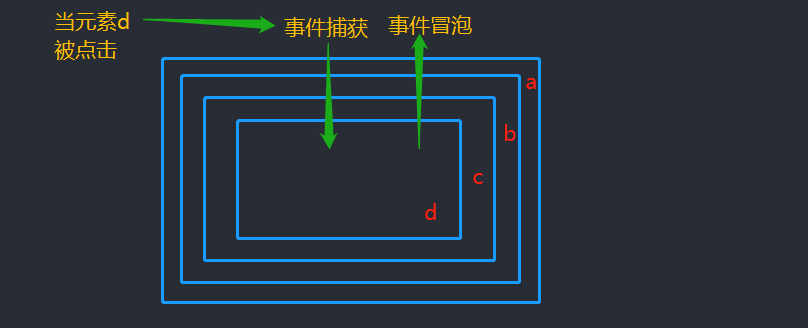

## DOM事件机制

文章标签：`addEventListener` `事件冒泡` `事件传播` `穿透` `currentTarget` `target`

#### 冒泡和捕获
当页面中一个元素被点击的时候，事件会从这个元素的祖先元素组成传递下来，这个过程成为`事件捕获`，当事件传递到这个元素，又会把事件逐层传递回去，直到根元素为止，这个阶段是事件的`冒泡阶段`。

```html
<body>
    <div id="a">
        <div id="b">
            <div id="c">
                <div id="d"></div>
            </div>
        </div>
    </div>
    
    <script>
        document.getElementById('a').addEventListener('click', function ( e ) {
            console.log('target:' + e.target.id + ' currentTarget:' + e.currentTarget.id);
        });
        document.getElementById('b').addEventListener('click', function ( e ) {
            console.log('target:' + e.target.id + ' currentTarget:' + e.currentTarget.id);
        });
        document.getElementById('c').addEventListener('click', function ( e ) {
            console.log('target:' + e.target.id + ' currentTarget:' + e.currentTarget.id);
        });
        document.getElementById('d').addEventListener('click', function ( e ) {
            console.log('target:' + e.target.id + ' currentTarget:' + e.currentTarget.id);
        });
    </script>
</body>
```

得到的结果
```js
 //点击d元素的时候；
    target:d  currentTarget:d    // d触发
    target:d   currentTarget:c    // c触发
    target:d  currentTarget:b    // b触发
    target:d   currentTarget:a    // a触发
```

#### addEventListener
我们为一个元素绑定一个点击事件的时候，可以指定是要在`捕获阶段绑定`或者`在冒泡阶段绑定`。 
* 当`addEventListener`的第三个参数为`true`的时候，代表是在捕获阶段绑定
* 当第三个参数为`false`或者为空的时候，代表在冒泡阶段绑定。<span style="color:red"><重点></span>

#### target 与 currentTarget

<div style="text-align:center;color:grey">图来自红宝书</div> 

我们可以看到 
1️⃣ `event.target`指向引起触发事件的元素，也就是图中的4️⃣阶段(比如说用户点击的元素)     

2️⃣ 而`event.currentTarget`则是事件绑定的元素，只有被点击的那个目标元素的`event.target`才会等于`event.currentTarget`。

3️⃣ 事件绑定的回调中的`this`始终指向的是`event.currentTarget`，也就是事件绑定的元素。<span style="color:green"><新颖></span>

### 阻止链式传播 
1️⃣ 使用`e.stopPropagation()`可以阻止事件的链式传播。 
2️⃣ 使用 `event.cancelBubble`也可以阻止事件的传播，一般用于兼容IE浏览器

##### 不支持事件冒泡的事件  
鼠标事件：`mouserleave`  `mouseenter`
焦点事件：`blur` `focus`
UI事件：`scroll` `resize`

___
### 参考文章
原文：[currntTarget VS target - by 枯荣](https://juejin.im/post/5a64541bf265da3e2d338862)     

相关笔记📒：[DOM事件模型](/JS/eventMode.md)