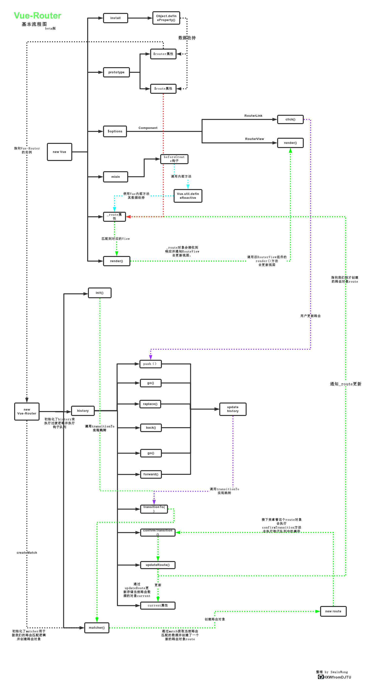

### When they go low - we go high

🌈 记录总结日常工作学习...欢迎star....

<!-- 2019 todo list  | status |
-| - |
`TypeScript` | 👋 learning |
`electron` | 🚩 working on |
`node - IPC` | 🚩 working on | -->

<!-- | 优化 | [防抖与节流](/JS/debounce.md) -->

 <!-- [数组方法](/JS/ARRAY_FUNC.md)[对象方法](/JS/OOJECT_FUNC.md)[原型链方法](/JS/JS_COMMON_FUNC.md)-->

<!-- [es6 class](/network/ES6/es6_class.md)
[类的继承](/network/ES6/es6_%E7%B1%BB%E7%9A%84%E7%BB%A7%E6%89%BF.md)
[async 下的异步编程](/network/ES6/async_await_conding.md) -->

<!-- ##### 浏览器系列
* [【浏览器系列 1-1】线程与进程](/browser/JS_browser_thread.md)
* [【浏览器系列 1-2】页面渲染-老话新谈](/network/how_browser_work.md)
* [【浏览器系列 1-3】浏览器存储](/browser/browser_storage.md)
* [【浏览器系列 1-4】Javascript垃圾回收](/JS/GC.md)
* [【浏览器系列 1-5】Javascript内存分配](/JS/memory_allocation.md)
* [【浏览器系列 1-6】浏览器跨域总结](/browser/CORS.md)`hot`
* [【浏览器系列 1-7】性能优化1 - 整体流程优化](/browser/rending_optimize.md)
* [【浏览器系列 1-8】性能优化2 - css基本性能优化](/CSS/css_optimize.md)
* [【浏览器系列 1-9】浏览器事件模型](/JS/eventMode.md)
* [【浏览器系列 1-10】浏览器中的cookie](/browser/cookie.md)   `new`
* [【浏览器系列 1-11】性能优化3 - 从渲染Timeline中深入交互优化](/browser/PaintTiming.md) `new`
* [【浏览器系列 1-12】屏幕刷新与requestAnimationFrame](/CSS/RAF.md)
* [【浏览器系列 1-13】性能优化4 - 从webpack打包配置的优化](/browser/webpack_optimize.md) `new`
* [【浏览器系列 1-14】性能优化5 - 从CSS合成层着手的渲染优化](/CSS/GPU.md) `写作中...`
* 【浏览器系列 1-15】性能优化6 - 前端资源重新加载  -->

<!-- | 其他 | [常见算法的JS实现](/algorithm/common.md/) -->

<!-- ##### ECMAScript 系列`Javascript` `ES6`
* [【ES6 1-1】Decorator - 肩负历史前行](/ES6/decorator.md)
* [【ES6 1-1】Async/await - 同步方式写异步](/ES6/async_await_conding.md)
* [【JS 2-1】Javascript EventLoop In Browser](/JS/eventloop.md)
* [【JS 2-2】再看闭包](/JS/closure.md)
* [【JS 2-3】作用域链](/JS/[[SCOPE]].md)
* [【JS 2-4】微任务](/JS/microTask.md)
* [【JS 2-5】Javascript模块化方案总结](/project_build/js_modules.md)
* [【JS 2-6】this指向哪里](/JS/apply_call_bind_this.md)
* [【JS 2-7】类型检测](/JS/type_inspect.md)
* [【JS 2-7】RAF-熟悉的陌生人](/CSS/RAF.md) `写作中...`
* [【JS 2-8】函数参数传值还是传引用](/JS/function_param.md)    -->

<!-- ##### Typescript
* 【Typescript 1-1】typescript中的模块化
* 【Typescript 1-2】ts + vue2.x 开发总结

##### 设计模式系列
* [【设计模式 1-X】设计模式总览](/design_mode/summary.md)
* [【设计模式 1-1】观察者模式](/design_mode/observer.md)
* [【设计模式 1-2】单例模式](/design_mode/singleton.md)
* [【设计模式 1-3】策略模式](/design_mode/strategy.md)
* [【设计模式 1-4】原型模式](/design_mode/prototype.md) -->

<!-- ##### 手写模拟系列
* [【数据结构 1-1】单链表](/algorithm/data_structure/linkedlist/)、[数组](/algorithm/data_structure/array/)、[顺序栈](/algorithm/data_structure/stack/) 、[顺序队列](/algorithm/data_structure/queue/)
* [【排序 2-1】冒泡排序](/algorithm/data_structure/sort/BubbleSort.js)、[选择排序](/algorithm/data_structure/sort/SelectSort.js)、[插入+希尔排序](/algorithm/data_structure/sort/InsertSort.js)
* [【排序 2-2】归并排序](/algorithm/data_structure/sort/MergeSort.js)、[快速排序](/algorithm/data_structure/sort/QuickSort.js)
* [【排序 2-3】计数排序](/algorithm/data_structure/sort/CountSort.js)、[桶排序](/algorithm/data_structure/sort/BucketSort.js)
* [【模拟 3-1】手工实现一个Promise](https://github.com/HXWfromDJTU/sw-promise)
* [【模拟 3-2】手工实现深拷贝](/algorithm/deepCopy.js)
* [【模拟 3-3】ES3模拟实现 apply-call-bind](/algorithm/bind.js)
* [【模拟 3-4】实现简单的eventEmitter](/algorithm/data_structure/observer.js)
* [【模拟 3-5】数组扁平化](/algorithm/flatten.js)
* [【模拟 3-6】防抖与节流](/algorithm/debounce_throttle.js)
* [【模拟 3-7】New_Extend_Create_Assign_Instanceof模拟](/algorithm/instanceof.js)
* [【模拟 3-8】LazyMan--模拟一个简单的异步链式调用栈](/algorithm/LazyMan.js)
* [【模拟 3-9】模拟一个基础的前端路由](/algorithm/router)  `new`
* [【模拟 3-10】模拟一个简单的KOA](https://github.com/HXWfromDJTU/sw-koa)  `new`

##### 网络传输系列
* [【传输层 1-1】DNS基本原理](/network/DNS.md)
* [【传输层 1-2】TCP与UDP](/network/network_class/TCP.md)
* [【应用层 2-1】HTTP 2.0🔱](/network/http/http2.0.md)
* [【应用层 2-2】HTTP状态码 - 从报文头一一分析](/network/http/status_code/summary.md) `hot`
* [【应用层 2-3】从报文分析HTTPS握手过程](/network/http/https.md)
* [【应用层 2-4】“熟悉而陌生”的GET_&_POST](/network/http/post_get.md)
* [【网络安全 3-1】XSS 与 CSRF](/browser/CSRF_XSS.md)
* [【摸索ssl证书申请及配置】](/network/https_certificate.md)

##### Node系列
* [【node系列 1-1】Node eventLoop](/node/core/eventloop_in_node.md)
* [【node系列 1-2】Node 异步I/O实现](/node/core/node_io.md)
* [【node系列 1-3】socket 与 FileDescription](/network/socket.md)
* [【node系列 1-4】libuv源码解读](/node/core/libuv/libUV.md)
* [【node系列 1-5】node多进程与egg.js](/node/multi_process.md)
* [【node系列 1-6】内建模块之V8](/node/core/v8/v8.md)
* [【node系列 1-7】小议node异常处理](/node/error_handler.md)
* [【node系列 1-8】node架构总览](/node/core/overview.md)

##### React源码解析
* [【React源码 1-1】从React.jsReact对象上的方法](/react/source_ch1.md)
* [【React源码 1-2】从Fiber对象说起的更新与调度](/react/source_ch2.md)

##### 框架 与 工具系列
* [【框架Vue 1-1】vue_compile相关](/vue/vue_render.md)
* [【框架Vue 1-2】vue_nextTick源码解读 与 eventLoop](./vue/nextTick.md)
* [【框架Vue 1-3】vue_DOM更新机制](./vue/vue_dom_nextTick.md)
* [【框架Vue 1-4】手供实现一个双向绑定](/vue/manual_two_way_binding.md)
* [【工具Babel 2-1】babel_原理&基础配置](./project_build/babel.md)
* [【工具Babel 2-1】babel_插件开发](./project_build/babel_plugin_dev.md)
* [【工具Webpack 3-1】webpack工作原理](/project_build/webpack/how_webpack_work.md)
* [【工具Webpack 3-2】webpack多入口配置](./project_build/webpack/multi_entry.md)
* [【框架ElementUI 4-1】源码解读之el-scrollbar](/network/elementUI/elementUI%E6%BA%90%E7%A0%81%E8%A7%A3%E8%AF%BB%E4%B9%8Bel-scrollbar.md)
* [【框架ElementUI 4-2】$message](/network/elementUI/$message.md)
* 【框架ElementUI 4-2】源码解读之Event机制
* [【工具git 5-1】git_flow](/project_build/git/git_flow.md)
* [【工具npm 6-1】node依赖包的版本管理](/project_build/npm_package_version.md) -->

<!-- [axios常见问题](/network/vue/axios%E5%B8%B8%E8%A7%81%E9%97%AE%E9%A2%98.md)-->

<!-- | 开发 | [node依赖包的版本管理](/project/node_module_manage.md)-->

<!-- [Vue组件数据流](/network/vue/Vue%E7%BB%84%E4%BB%B6%E6%95%B0%E6%8D%AE%E6%B5%81.md)-->

<!-- ##### Chrome Devtools使用指南 （待完成）
* 【Devtools 1-1】Element面板 - Rendering
* 【Devtools 2-1】Source面板  - 断点与资源分布
* 【Devtools 3-1】Network面板 - 网络调试
* 【Devtools 3-2】Network面板 - timeline
* 【Devtools 3-3】Performance - 性能监测  -->

<!--
##### 项目难点系列
* 轨迹计算+绘图导致的UI卡顿 -->

<!-- ##### python系列
* [【python系列 1-1】爬虫练习](/python/python/crawler.md)
 -->

<!-- ##### 归纳图例 -->
<!-- ###### vue双向绑定流程图

###### Vue-router实现流程图
 -->

       

知识就是需要不断更新，2020更多博客文章正在迁移整理中...请耐心等待🚧

## 反思与沉淀
[质量提升 之 日常开发自查表](https://github.com/HXWfromDJTU/blog/issues/30)       
[效率提升 之 小团队测试流程优化](https://github.com/HXWfromDJTU/blog/issues/32)      
[效率提升 之 前端工作流总结](https://github.com/HXWfromDJTU/blog/issues/33)     

## 安全
[前端安全 - CSRF 原理与一次实战](https://github.com/HXWfromDJTU/blog/issues/29)     

## 客户端
[客户端 - 尝试做一个 Native 与 JS 通信工具](https://github.com/HXWfromDJTU/blog/issues/34)        

## 网络编程
[Socket 编程 - File Description](https://github.com/HXWfromDJTU/blog/issues/12)     
[Socket 编程 - I/O 多路复用](https://github.com/HXWfromDJTU/blog/issues/13)    
[Socket 编程 - tcp与udp socket](https://github.com/HXWfromDJTU/blog/issues/14)    
[websocket - 项目笔记[1] - 鉴权、安全、心跳 ](https://github.com/HXWfromDJTU/blog/issues/15)       
[websocket - 项目笔记[2] - 封装一个简单的lib](https://github.com/HXWfromDJTU/blog/issues/16)   
[DNS - 再聊DNS工作原理及其应用、优化](https://github.com/HXWfromDJTU/blog/issues/19)  

## Node.js
[Node.js - 流程梳理，从v8、libuv到EventLoop](https://github.com/HXWfromDJTU/blog/issues/25)    
[Node.js - Buffer、Stream 与 fs](https://github.com/HXWfromDJTU/blog/issues/26)     
[Node.js - koa-compose 解读](https://github.com/HXWfromDJTU/blog/issues/11)      

## 浏览器
[cookie 系列 - 有效范围、安全与隐私](https://github.com/HXWfromDJTU/blog/issues/22)       
[cookie 系列 - 你的 Token 还好吗？浏览器 SameSite 的 breaking change 应对办法](https://github.com/HXWfromDJTU/blog/issues/31)       
[浏览器原理 - JavaScript 的 EventLoop](https://github.com/HXWfromDJTU/blog/issues/24)     
[浏览器系列 - 简单读懂渲染Timeline](https://github.com/HXWfromDJTU/blog/issues/27)   
[浏览器系列 - 同源策略 与 跨域安全](https://github.com/HXWfromDJTU/blog/issues/28)     

## V8
[V8 - 宏任务微任务](https://github.com/HXWfromDJTU/blog/issues/23)  
[V8 - 内存分配与GC](https://github.com/HXWfromDJTU/blog/issues/21)  
  

## 前端模块化
[前端模块化 - CommonJS](https://github.com/HXWfromDJTU/blog/issues/4)  
[前端模块化 - ES6 Module](https://github.com/HXWfromDJTU/blog/issues/5)  
[前端模块化 - CommonJS 与 ES6 Module 差异比较](https://github.com/HXWfromDJTU/blog/issues/6)  
[前端模块化 - Webpack](https://github.com/HXWfromDJTU/blog/issues/9)  
[前端模块化 - CMD 规范](https://github.com/HXWfromDJTU/blog/issues/8)  
[前端模块化 - AMD 规范](https://github.com/HXWfromDJTU/blog/issues/7)  

## JavaScript
[Decorator - 从 AOP IOC descriptor、decorator mode 开始说 ](https://github.com/HXWfromDJTU/blog/issues/10)        
[基础深挖 - 变量存储与堆栈](https://github.com/HXWfromDJTU/blog/issues/17)    
[基础深挖 - 深浅拷贝循序渐进慢慢写](https://github.com/HXWfromDJTU/blog/issues/18)       
[基础系列 - 奇怪的 0.1 + 0.2 与 IEEE 754](https://github.com/HXWfromDJTU/blog/issues/20)   

