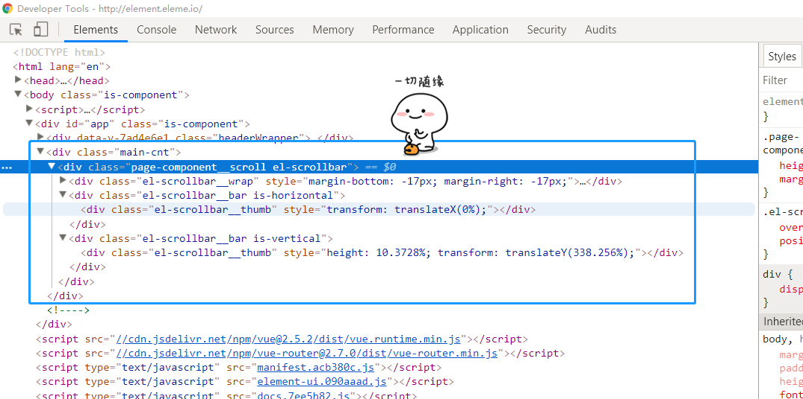

# elementUI源码解读之el-scrollbar
> 使用elementUI项目改版深入，发现页面内的多个模块都需要展示很多内容
这时候，页面内粗线了多个`又大又粗`的滚动条:expressionless:

>正在寻找Vue下管理滚动条的解决方案时。
咦？发现了elementUI官网右侧若隐若现的滚动条，下意识地F12了一下，便开始了`el-scrollbar`的发现之旅:smiling_imp:

devtools中的`el-scrollbar`


源码包中
```file
>scrollbar
 |->src
 |   |-bar.js
 |   |-main.js
 |   |-util.js
 |-index.js
```

既然官网不给文档，那我们自己动手吧

先看最简单的 `index.js`
```javascript
import Scrollbar from './src/main';

/* istanbul ignore next */
Scrollbar.install = function(Vue) {
  Vue.component(Scrollbar.name, Scrollbar);
};

export default Scrollbar;
```
:joy:haha~引入了个scrollbar组件，然后定义install方法使得`Vue.use(Scrollbar)`的时候，得以进行挂载，并把`scrollbar`暴露出去

这里提到了`main.js`，看看去
```javascript
import { addResizeListener, removeResizeListener } from 'element-ui/src/utils/resize-event';
import scrollbarWidth from 'element-ui/src/utils/scrollbar-width';
import { toObject } from 'element-ui/src/utils/util';
import Bar from './bar';
```
引入了三个配置，依次是`Resize事件的监听器`，`scrollbar全局配置的宽度`，`toObject工具函数`，和一个子组件`bar`
```js
props: {
    native: Boolean,
    wrapStyle: {},
    wrapClass: {},
    viewClass: {},
    viewStyle: {},
    noresize: Boolean, // 如果 container 尺寸不会发生变化，最好设置它可以优化性能
    tag: {
      type: String,
      default: 'div'
    }
},
```
`wrapStyle`、`wrapClass`、`viewClass`、`viewStyle`....咦？貌似有点眼熟。我们在渲染后的页面中，也发现了`view`和`wrapper`的字眼，tag参数还有个`default:'div'`估计是可以选择包裹层的标签，其他俩猜不到，继续往下看吧
`main.js`的`render(h)`部分