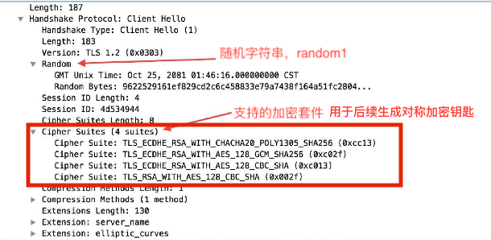
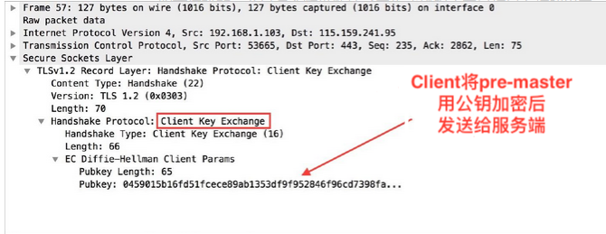
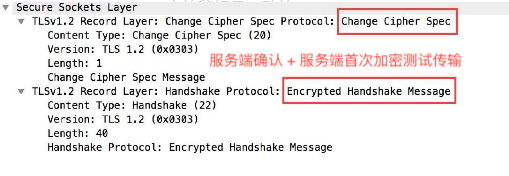

# HTTPS生态了解
### what is https
* `https` 全称 `(Hyper Text Transfer Protocol over Secure Socket Layer)`，也就是在原`http`协议下，添加`SSL(Secure Socket Layer)`层
* `https`最大的亮点就是`SSL`层加对数据的加密

### why use https?
* 从原来的`http`协议缺点来看：
    ① 传输的时候使用明文传参，极其容易被第三方截取
    ② 没有访问发起者的身份认证机制，第三方即可以十分容易地使用终端发起大量伪请求
    ③ 报文段被部分篡改，服务器端也无法识别

### HTTPS 与 HTTP的不同点
* `http` 的`URL` 以`http://` 开头，`https`以`https://` 开头
* `HTTP`采用的是明文传输，而`HTTPS`使用的是`SSL\TSL`进行加密传输
* `HTTP`的默认端口是`80`，而`HTTPS`的默认端口是`443`
* `HTTPS` 需要`CA`证书，`http`不需要。
* http 的连接很简单,是无状态的，`https`协议是由`SSL+http`协议构建的可进行加密传输、身份认证的网络协议 要比`http`协议安全

### 对称加密 和 非对称加密
* 非对称加密的公钥只能够用于加密，非对称加密的私钥既能加密也能够解密
* 对称加密速度快，可以加密的信息量较大
* 非对称加密算法复杂，加密解密速度慢，一般用于少量信息加密
  
### HTTPS的劣势
* 因为加密的需要，常见的三握手就要多几个来回
* 对服务器的负载增加
*  因为对传输进行加密，会一定程度增加cpu消耗。
*  由于https 要还密钥和确认加密算法的需要，所以首次建立连接会慢一些。
*  带宽消耗会增加。
### SSL\TSL 握手流程
___

#### ① Client Hello 
> 客户端向服务器发送准备链接的信息(相当于打招呼),    并且告诉服务器自己支持哪些加密套件
##### 参数：
  * 随机数 Random1
  * 客户端支持的加密套件（Support Ciphers）

#### ② Server Hello
> 服务器响应 客户端的打招呼，返回包括
##### 参数 
   * 服务器从客户端发过来的陶建中，选择了具体的一个加密套件
   * 随机数 Random2

 

#### ③ Certificate
> 这一步是服务端将自己的证书下发给客户端，让客户端验证自己的身份，客户端验证通过后取出证书中的公钥。
##### 参数
* (服务端 ==>  客户端 )证书
* 客户端取出证书中的公钥

#### ④ Certificate Request & Server Hello Done
> Certificate Request 是服务端要求客户端上报证书（可选）

> Server Hello Done 通知客户端 Server Hello 过程结束

#### ⑤ Certificate Verify  & Client Key Exchange
* 先从 CA 验证该证书的合法性
* 验证通过后取出证书中的服务端公钥，再生成一个随机数 Random3
* 再用服务端公钥非对称加密 Random3 生成 PreMaster Key。
  > 注意：这里若证书合法性验证失败，则会告知用户改证书有风险。
##### 参数
* `PreMaster Key`

至此，使用之前生成的(random1 + random2 + random3)随机数,再使用共同确认的加密算法，生成的`key`，接下来准备开始双方测试加密传输。

#### ⑥ Change Cipher Spec & Encrypted Handshake Message （客户端测试加密连接）
> 首先是客户端通知服务端后面再发送的消息都会使用前面协商出来的秘钥加密了，是一条事件消息。

> 再是客户端将前面的握手消息生成摘要再用协商好的秘钥加密，这是客户端发出的第一条加密消息。

#### ⑦ Change Cipher Spec & Encrypted Handshake Message （服务端测试加密连接）
>首先是服务端通知客户端后面再发送的消息都会使用加密，也是一条事件消息

>再是服务端也会将握手过程的消息生成摘要再用秘钥加密，这是服务端发出的第一条加密消息

   * 使用加密套件的私钥进行解密，获得随机数
   * 服务端使用对称加密算法，对获取到的随机数进行对称加密，得到“指定加密算法” + “随机生成数” 结合的一个特殊令牌
   * 服务器使用这个令牌加密需要保护的内容主体，一并发送给客户端
   
#### ⑧客户端 
  * 使用`key`进行加密数据传输

#### 总结

### 相关连接
[https实操](network/https_onwork.md)

