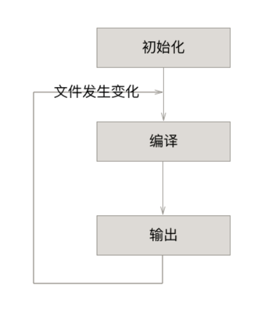

# webpack工作流程

___
本期封面不要脸滴用了`webpack`官网的封面图，也体现了`webpack的核心`，和区别于`gulp`、`grunt`之类工具的核心部分 --- 模块化
  
官方简介都说了诶，我们是一个骄傲的`module bundler`

## 模块化系统
组织开发中的碎片化资源合代码，整合成浏览器能够识别的的资源。

##### 其他模块化方案
1️⃣ AMD 
2️⃣ CMD（玉伯的sea.js）
3️⃣ CommonJS  
模块之间的引用关系，在编译时就可以确定，而不是运行的时候。
CommonJS 和 AMD 模块化方案，都只能够在运行的时候才确定依赖关系。
1️⃣ 优点：开发的时候容易分析，模块关系明确。
2️⃣ 缺点：原生浏览器还不能直接实现  
[详细了解，传送门>>>](/project_build/js_modules.md) 
##### 模块化的目标
1️⃣ 实现分块传输，按需进行懒加载。
2️⃣ 在实际用到某些模块的时候，在进行增量打包更新。
3️⃣ 一切皆模块，样式、图片、字体、HTML模板等资源，都可以视为模块。
___
### webpack 职责

##### 代码拆分
`Webapck`整合了同步和异步两种加载形式。一步的以来作为代码的分割点，形成新的模块。

##### Loader 
`Webpack`本身只能够解析JS代码，各种`Loader`是的`Webpack`拥有解析各种文件的能力

##### 智能解析
`Webpack`内置了一些解析器，能够处理常见的很多第三方库，兼容`CommonJS`、`AMD`普通的文件。

##### 插件系统
`Webpack`当然少不了工嗯呢强大的插件的插件。   

___

### 工作流程

#### 初始化参数
从配置文件和`Shell`语句中读取与合并参数，得到最终参数。

#### 开始编译
根据合并后的参数，初始化`Compiler`对象，加载所有的配置插件，执行对象的`run方法`开始执行编译。

#### 编译模块
从`entry`中找所有的打包入口，从入口文件出发，调用所有配置的`Loader`对模块进行翻译，再找出该模块依赖的模块，递归执行直至所有的入口都经过了本步骤的处理。得到最后所有模块的依赖关系。

#### 资源输出
根据入口和模块之间的依赖关系，组装成一个个包含多个模块的`Chunk`，再把每个Chunk转换成一个单独的文件加入到输出列表。

#### 输出完成
在确定好输出的内容后，根据输出的路径和文件名，把文件写入到文件系统。

图片来自[文章](https://juejin.im/entry/5b0e3eba5188251534379615)

### webpack阶段事件
贯穿整个工作流程，类似于生命周期一样，`webpack`会向外广播每个阶段的事件。

___
### 参考文章
[webpack运行原理 -by Jrain](https://segmentfault.com/a/1190000015291911)

