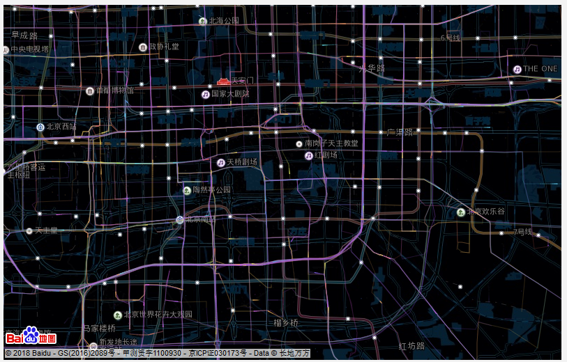
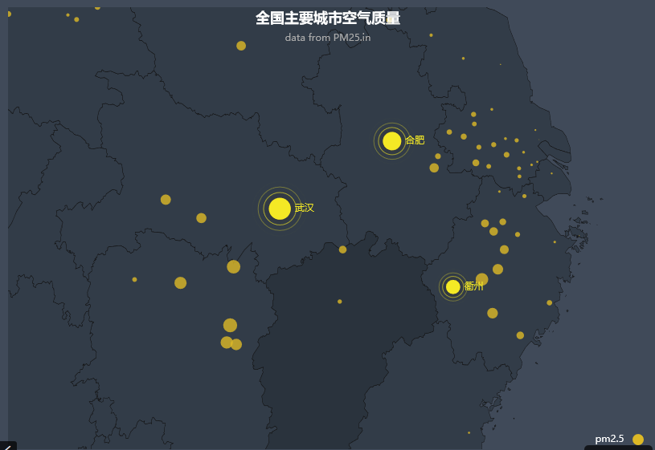
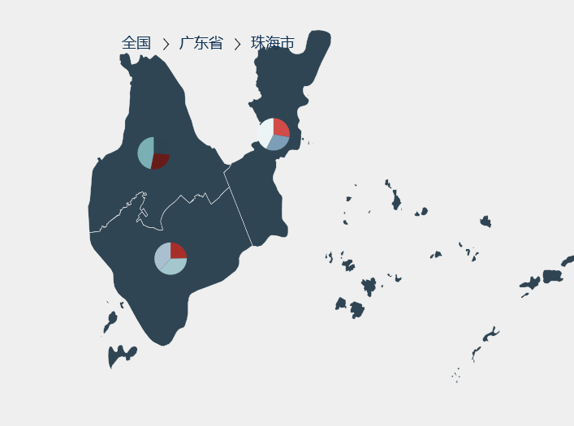

# 路网地图

## 需求点
* 要有可以层级缩放的路网地图
* 需要能够在地图上绘制点、线条，点要能够移动

## 技术分析
* 需要百度或者高德地图作为背景的路网地图    [链接摸我](http://echarts.baidu.com/examples/editor.html?c=lines-bmap-effect)

* 需要点绘制  [案例摸我](http://gallery.echartsjs.com/editor.html?c=effectScatter-map)
   
* 需要线条绘制 [案例]()
* 需要数据动态注入
* 公交车动态效果 [案例](http://echarts.baidu.com/examples/editor.html?c=lines-bmap-effect)
* 数据来源
* 数据格式
* 可层级下钻 [链接摸我](http://gallery.echartsjs.com/editor.html?c=xBkrfv2nfm)
   