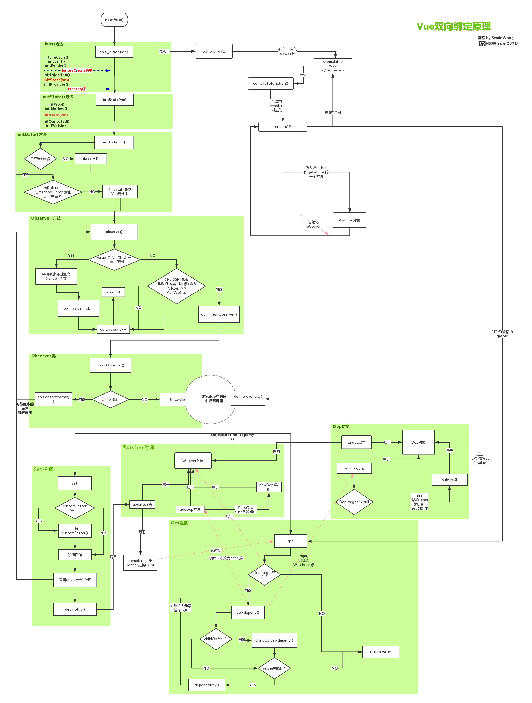

# Vue源码解读之 双向绑定
Vue2.0是包括多个部分，其中`数据双向绑定`的实现，使用的是著名的`观察者/订阅者模式`来设计的
### Vue 双向绑定实现流程

* 给需要检测的数据，通过循坏调用`Object.defineProperty`的形式，来实现数据`赋值(set)`和`取值(get)`的拦截
* `get`拦截中，先判断当前`Dep.target`是否为空，若不为空，则加入到`dep.subs`订阅者数组中去。
#### watcher
* `Watcher`的创建
  * 组件渲染时候，`vue`先`compileToFunction`函数将组件中的`template`，生成一个`render`函数。
  * 创建一个 `watcher` 对象，并将生成的`render`函数传递给这个Watcher对象用于`DOM`更新，创建之时也会调用一次`render`方法
  * 调用`render`方法时候，会去访问到传入的`template`中的`data`选项的值，那么就会被`data`的`getter`方法拦截到
  * 被拦截到后，则会将这个`Watcher`对象添加到依赖中
* `Watcher`的使用
  * 一个`watcher`对象对应一整个`template`的数据监控
  * 只要`template`中的任意一个数据发生变化，`Watcher`对象都会调用之前传入的`render`方法去重新渲染
  * 因为`Vue2.x`系列已经采用`Virtual DOM`，当`data`改变时，使用优化的`diff`算法，只会重新渲染修改了的部分。

### Q & A？
> 1、Dep对象是什么
* 【dep】
`Dep`对象是用于处理数据依赖的，每一个dep都有一个id，每一个`Observer`对应一个`Dep`
* 【dep.subs】
 `dep.sub`用于记录所有会取该`data`的`Watcher`对象(也就是一个存放`Watcher`对象的数组)，当该数据发生变化时(get或者set)，`dep对象`就会`通知`subs数组`中的所有`Watcher对象`进行更新。
* 【dep.notify】
上面提到的通知，即是`dep.notify`，`set`方法会调用`dep.notify`方法来通知所有依赖的`Watcher`对象，让他们调用自己的`update`方法来进行更新，去更新他们所在的`template`
* 【dep.target】
   指向当前数据的`Watcher`对象
>2、observe() 方法的作用

* `observe`方法主要用于给数据，挂载 Observer()类
* `Observer()`类。主要用于递归地监听对象上所有的属性（通过`walk`方法），在属性值发生改变的时候，触发相应的`Watcher`
> 3、walk方法的作用是什么？

* `walk`方法会对`value`中的属性循环调用 `definereactivity` 方法。
* `definereactivity` 方法，是Vue是实现通过`Object.definedProperty`监听`get/set`的包装方法 
* 调用`JS`原生的 `Object.defineProperty()`给每一个变量设定`get/set`拦截，使得平时我们的`取值`与`赋值`是通过内部操作之后才进行的，这也是`Vue`实现双向绑定的核心。
>4、Watcher对象的作用

* `Watcher` 是观察者的角色，用于监听`template`的`data`数据的变化。当检测的数据的`get/set`被触发的时候，执行自身的`render函数`更新`VirturalDOM`

>5、有时候监听不到数据的变化？

`data`选项中的数据是在组件初始渲染的时候，就进行`get/set`的监听，在初始化之后再绑定到data选项上的数据，是无法实现数据拦截的。

>6、修改数据之后，马上去获取对应的DOM值，为何还未发生改变？

`Vue`为了避免频繁地操作`DOM`，所以使用队列，收集一个`'tick'`的变化，等到'tick'完成的时候，才一次性去更新这些`DOM`内容。
