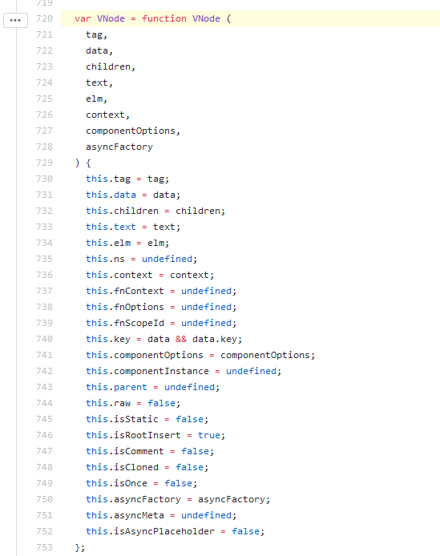
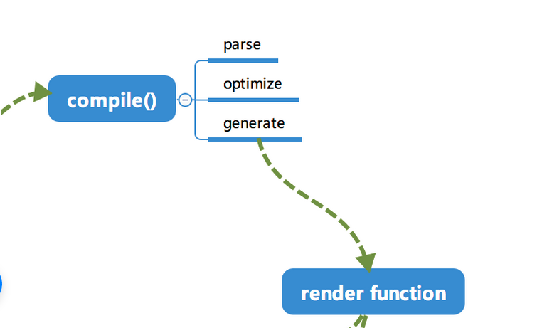
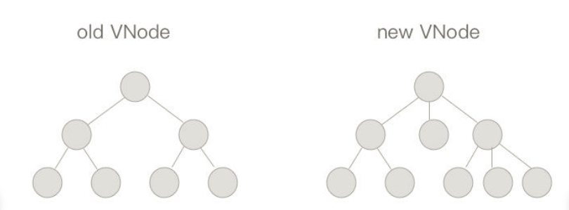
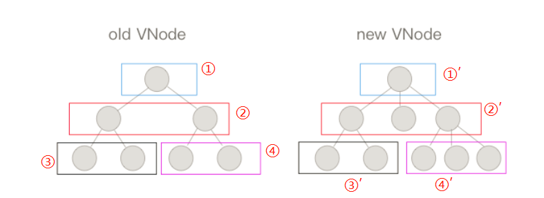

# Vue 渲染过程 相关补充

### VNode
 `v-node`是用`json`格式来保存数据节点信息的方法。用来储存一个节点的所有信息。

### Virtual Dom
 `virtual dom` 是 `v-node` 组成的一个 虚拟节点树，实质上也是用`JS`对象取存储节点信息的集合。v-node组成了`virtual dom`。

 v-node
 ```js
{
    tag: 'div'
    data: {
        class: 'test'
    },
    children: [
        {
            tag: 'span',
            data: {
                class: 'demo'
            }
            text: 'hello,VNode'
        }
    ]
}
 ```

 DOM
 ```html
<div class="test">
    <span class="demo">hello,VNode</span>
</div>
 ```
#### v-node优点
* 因为依赖的是js本身而不是DOM，所以可以实现在意JS为基础的应用上跨平台使用(weex、小程序、node等)。
* 不需要去频繁地操作真实的`DOM`，减少浏览器开销，操作`v-node`然后一次更新`DOM`，效率更高。

来看看`vue`源码中对`vnode`的声明，[摸我跳转尤大神github](https://github.com/vuejs/vue/blob/3b43c81216c2e29bd519c447e930d6512b5782e8/dist/vue.common.js#L720)

简单明了，就是传入一些节点的相关信息，然后用`js`对象重构了它。

### render function
  `render fucntion` 是由 `template` 模板 通过`complie`而得到的，主要分为以下三步：
 *  `parse` 解析阶段
       会首先将传入 的`template` 字符串，使用复杂的正则表达式将模板转化成 `AST`(抽象语法树)
 * `optimize` 优化阶段
    * `isStatic方法` 用于标判断是否为静态节点
    * `markStatic方法`  用于循环执行`isStatic`去标记静态节点
    * `markStaticRoots方法` 用于标记静态根节点
 * `generate` 转化生成阶段
      * `generate`会将优化后的`AST`转化成 `render function` 
      * 最终得到 `render` 的字符串以及 `staticRenderFns`的字符串

### patch

`model`中的数据进行更新时，会触发对应的`Dep`依赖中的`Watcher`对象，`Watcher`对象则调用对应的`update`方法来修改视图。最终新的`vnode`与旧的`vnode`会进行一个 `patch`比较过程。比对得到差异，然后只会更新这部分`差异`到视图上。 
##### differ 算法

##### `diff`算法的特点
* 只对同层节点进行比较
* 并不是对树进行逐层式的遍历搜索
* 时间复杂度只有 O(n) 

<div style="text-align:center;">图中就只有②和④两处不一样</div>
##### 比较过程：
* `oldVode` 与 `newVnode` 有一方为空的时候，另一方直接替换它
* 若二者都不为空，则进行`sameVnode`判断，若标签更变了，则直接替换
* 若`sameVNode`判断得到，没有更变。则进行 `patchVnode`比对。

##### 交叉比对
* `nodeOps` 是一个适配层，根据不同平台提供的不同的操作 DOM 的方法，用于实现跨平台操作DOM


### 参考文章
* [说说vnode节点 by 染陌](https://juejin.im/post/59b53a595188257e7406fe3d)
