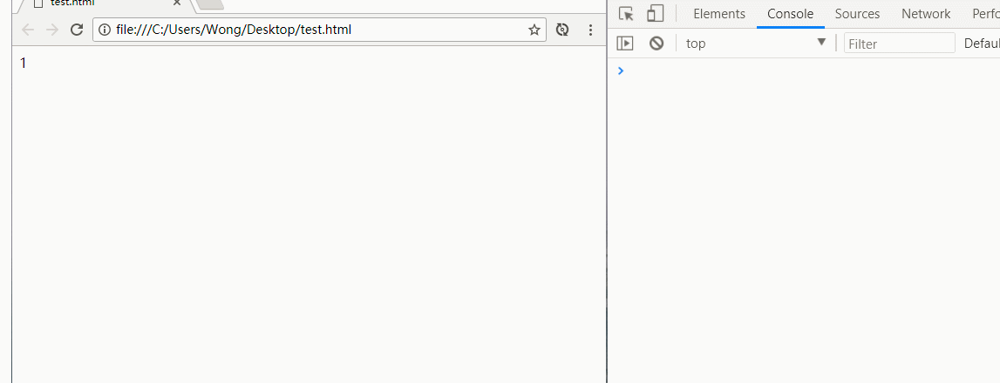

# 手写一个Vue双向绑定

前一篇文章写了vue的双向绑定原理
我们尝试一下简化流程，处理核心思想，实现一个简单的双向绑定
我们知道，Vue绑定的核心思想是三个东西
① `Watcher对象`管理对应的`template`，当接收到`Dep`的通知时，更新DOM
② `Observer对象`给数据绑定读写拦截
③ `Dep对象`管理调度`Observer`和`Watcher`，保存数据的依赖
废话不多说，直接上代码

### Watcher对象
```js
function Watcher(fn){
	this.update = function(){
		Dep.target = this;
		fn();
		Dep.target = null;
	}
	this.update();
}
```
### Observer对象
```js
function Observer(testObj, key, value){
	var dep = new Dep();
	if (Object.prototype.toString.call(value) == '[testObject Object]') {
		Object.keys(value).forEach(function(key){
			new Observer(value,key,value[key])
		})
	};
	Object.defineProperty(testObj, key, {
		enumerable: true,
    	configurable: true,
    	get: function(){
    		if (Dep.target) {
    			dep.addSub(Dep.target);
    		};
    		return value;
    	},
    	set: function(newVal){
    		value = newVal;
    		dep.notify();
    	}
	})
}
```
### Dep()对象
```js
function Dep(){
	this.subs = [];

	this.addSub = function (watcher) {
		this.subs.push(watcher);
	}

	this.notify = function(){
		this.subs.forEach(function(watcher){
			watcher.update();
		});
	}
}
```
页面调试
```html
<div id="testValue">init value</div>
<script type="text/javascript">
    var testObj = {
        a: 1,
        b: 2,
        c: 3
    }
    // 给每一个值都绑定上Observer对象，进行get/set拦截
    Object.keys(testObj).forEach(function (key) {
        new Observer(testObj, key, testObj[key])
    });
    //创建一个watcher对象，用于执行回调
    new Watcher(function () {
        //将 testObj.a 的值显示出来
        document.querySelector("#testValue").innerHTML = testObj.a;
        console.log(testObj.a)
    })
</script>
```
* 调试效果  



